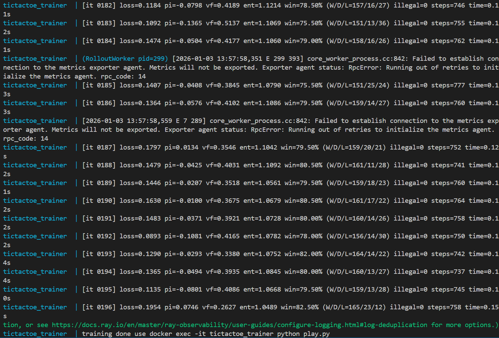
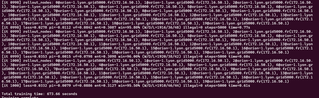
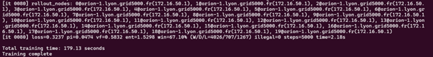

# Tic-Tac-Toe AI with Reinforcement Learning

## Overview
This project implements a Reinforcement Learning agent that learns to play **Tic-Tac-Toe** using the **Advantage Actor-Critic (A2C)** algorithm.  
The agent is trained through **self-play against a random opponent** and can also be played interactively by a human user.

---

## Project Structure

### Core Components
- **env.py** : Tic-Tac-Toe game environment  
- **model.py** : Actor-Critic neural network with legal move masking  
- **worker.py** : Ray remote workers for parallel episode collection  
- **losses.py** : A2C loss computation and training logic  
- **main.py** : Main training script  
- **play.py** : Interactive interface to play against the trained AI  

---

## How It Works

### Training Process
1. Multiple Ray workers collect game episodes in parallel  
2. Workers play using the current policy against a random opponent  
3. Trajectories are collected (states, actions, rewards, values)  
4. A central trainer computes the A2C loss and updates the policy  
5. Updated weights are broadcast back to all workers  
6. The process repeats for a fixed number of iterations  

### Network Architecture
- **Input:** 9 values representing the board  
  - `1` = X, `-1` = O, `0` = empty  
- **Hidden Layers:**  
  - 2 fully connected layers with 128 units each  
- **Outputs:**  
  - **Policy head:** 9 action logits (with legal-move masking)  
  - **Value head:** Single scalar state value  

---

## Example: Local Training Output

Below is an example of running `main.py` to train the agent.  
It shows training iterations, loss values, win rate, and rollout statistics.



---

## Quick Start

### Prerequisites
- Docker & Docker Compose (recommended)  
- Python 3.8+ (for local execution)  

---

## Running with Docker (Recommended)

### Build and start training
```bash
docker-compose -f docker-compose-local.yml up --build
```

This will:
- Build the Docker image  
- Train the model in 200 iterations with 4 parallel workers  
- Save the trained model to `saved_models/model.pt`  
- Keep the container running for interactive play  

### Play against the trained AI
```bash
docker exec -it tictactoe_trainer python play.py
```

---

## Running Locally (Without Docker)

### Install dependencies
```bash
pip install -r requirements.txt
```

### Train the model
```bash
python main.py
```

### Play against the AI
```bash
python play.py
```

---

## Deployment on Grid’5000

### Motivation
To study the impact of distributed reinforcement learning, we deployed our implementation on the **Grid’5000** experimental testbed.  
This allowed us to compare single-node versus multi-node training using the same codebase and hyperparameters.

---

### Access and Reservation
We access Grid’5000 via SSH:

```bash
ssh akhamri@access.grid5000.fr
ssh lyon
```

Nodes were reserved using OAR. All experiments were conducted on the **Lyon site**, using CPU-only nodes.

We used two configurations:
- **Single-node**: 1 node with 24 CPUs  
- **Multi-node**: 1 head node + 2 worker nodes  

---

### Ray Cluster Management Scripts
To simplify cluster management, several shell scripts were created:

- **g5k_start_ray_1head2workers.sh** – start Ray head + 2 workers  
- **g5k_stop_ray.sh** – stop Ray on all nodes  
- **g5k_train.sh** – launch training with configurable parameters  

```bash
./g5k_train.sh <num_workers> <iterations> <episodes_per_worker>
```

---

## Distributed Training Architecture

### Parallel Rollouts
Each rollout worker is implemented as a Ray actor:

```python
@ray.remote(num_cpus=1)
class RolloutWorker:
    ...
```

Each worker runs an independent environment and collects trajectories in parallel.

---

### Centralized Learning
All learning is performed on the head node:
- Trajectories are aggregated
- A2C loss is computed
- Model parameters are updated
- Weights are broadcast back to workers

This design simplifies correctness but limits scalability.

---

## Verifying Parallelism

Workers report their hostname and IP address.  
At each iteration, the learner logs:

```
[it 0042] rollout_nodes:
0@orion-1(172.16.50.1),
1@taurus-10(172.16.48.10),
2@taurus-13(172.16.48.13)
```

This confirms that rollouts were executed in parallel across multiple nodes.

---

## Experimental Results

### Setup A
- 20 rollout workers  
- 1000 training iterations  
- 50 episodes per worker
- Identical hyperparameters  

### Training Time Comparison A

| Configuration | Total Training Time |
|---------------|---------------------|
| 1 node        | ~670 seconds        |
| 3 nodes       | ~560 seconds        |

This corresponds to a **~20% speedup** using multi-node execution.




### Setup B
- 20 rollout workers  
- 80 training iterations  
- 1000 episodes per worker
- Identical hyperparameters  

### Training Time Comparison A

| Configuration | Total Training Time |
|---------------|---------------------|
| 1 node        | ~180 seconds        |
| 3 nodes       | ~137 seconds        |

This corresponds to a **~31% speedup** using multi-node execution.




---

## Interpretation

Multi-node execution consistently reduces training time. Scalability remains limited by:
- Centralized learning
- Communication overhead
- Lightweight environment dynamics

---

## Limitations and Future Improvements

- **Self-play against previous policies** instead of a random opponent  
- **Reduce learner bottleneck** (asynchronous updates, minibatching)  
- **Heavier environments** to better exploit parallelism  

---

## Conclusion

This project demonstrates a full **custom Actor-Critic implementation**,  
its **distributed execution with Ray Core**,  
and a **quantitative comparison** between single-node and multi-node training on Grid’5000.

---

## Authors & Contributions

- **Achraf Khamri**  
- **Khalil Lamharchi**

### Work done by Khalil Lamharchi
- Tic-Tac-Toe environment and game logic  
- Interactive play interface  
- Model export and saving  
- Local Docker-based training setup

### Work done by Achraf Khamri
- Adapting the environment for reinforcement learning
- Development of cluster management scripts
- Deployment on Grid5000
- Performance comparison experiments